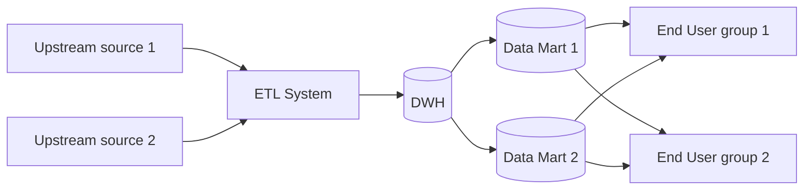
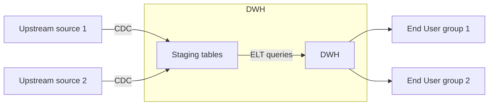
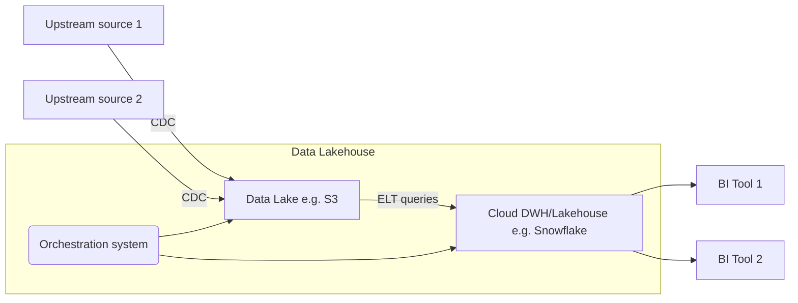
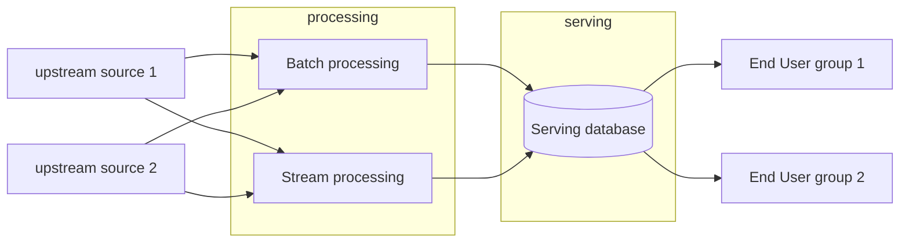
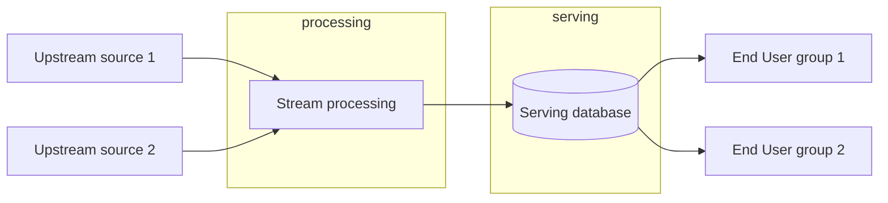

### What data architecture is
Data architecture is essentially a subset of enterprise architecture.

Enterprise architecture is: design of systems to support change in the enterprise, achieved by flexible and reversible decisions reached through careful evaluation of tradeoffs.
This involves a few important considerations: reversible and irreversible decisions, change management (breaking down huge changes into the right small steps) and defining technical decisions as being in support of the business goals (and making tradeoffs accordingly, since they are inescapable in engineering).

Data architecture, as a subset of enterprise architecture, is: the design of systems to support the evolving data needs of an enterprise, achieved by flexible and reversible decisions reached through a careful evaluation of tradeoffs. Data architecture encompasses operational architecture (SOPs, decision processes, etc.) and technical architecture (branching strategies, tooling decisions, engineering practices and implementation). Good data architecture is flexible and allows systems to evolve with the rest of the enterprise, while remaining highly maintainable.

### Principles of good data architecture
- Choose common components wisely
    - This is technical. This has to do with partitioning architecture in a way that the right parts are shared between systems and the right parts are individual. Getting this right requires a keen understanding of workflow of the different products and teams using different systems. This is frequently easier with cloud platforms which allow relatively easy separation between different components.
- Plan for failure
    - Systems should be examined for failure and failure and recovery scenarios should be thought through. Important concepts to grasp are:
        - Availability (what % of time the system is in an operable state)
        - Reliability (probability of meeting defined standards in performing the intended functions in a given interval of time)
        - Recovery time objective (max acceptable time for a service or system outage, usually determined by business impact)
        - Recovery point objective (the acceptable state of recovery: i.e. how much data loss is acceptable)
- Architect for scalability
     - Amount of data flowing through the enterprise is variable, systems must be designed such that they are not overprovisioned (too expensive) or underprovisioned (too unavailable when more data incomes)
- Architecture is leadership
    - Data architects should not exercise complete command-and-control, but should guide individual teams and members to the best practices, and set standards.
- Always be architecting
    - The target architecture should follow the evolution of the business, and the architect must be in constant contact. There should not be a final state.
- Build loosely coupled systems
    - Technical context:
        - Break system into many small components, ensure these components communicate through abstraction layers and do not expose backends
        - Internal changes in one component do not require changes in other parts
        - There does not exist a global release plan or waterfall
    - Operational context:
        - Teams engineer individual components of the whole system, and publish to other teams only details of abstractions, not under-the-hood details.
        - Each team can rapidly evolve their components and schedule releases on their own.
- Make reversible decisions
    - Requirements valid today may well change tomorrow. Architecture choices must be made such that they can be changed.
- Prioritize security
    - Zero trust - do not trust the external perimeter of the system to be the sole defense, make sure that individual components are defended.
    - Shared responsibility model of security - Do not expect someone to take care of security of your data and systems, you have your own responsibility to configure it.
- Embrace FinOps
    - Control costs, as many cloud vendors are pay-as-you-go. Think about what your compute/software costs in general, how you will track costs, amd what are your appropriate/inappropriate costs. Partner with your Finance team for this.

### Some major architecture concepts 
- Domains and services
  - A domain is a real-world business area for which you are building solutions. A domain can have a number of services, where a service represents a set of functionality with a clearly defined task. Domains may share services (e.g. invoice service may be shared by sales and accounting domain). The best way to grasp domains and services in an org is to talk to real-world teams. 
- Distributed systems, scalability, and design for failure
  - Scalability is to which extent a system's capacity may change to adjust to lower or higher load. Elasticity is how fast the system can be scaled up or down. Availability is the % of time in a given period that a system is operable, reliability is how likely a system is, overall, to perform its expected tasks in a given period. Designing for failure is designing a system such that it has reserve resources and error handling logic to meet its availability/reliablility goals even if something goes wrong. Architecturally, distributed architecture is often used, as overreliance on a single machine often causes failures (e.g. distributed database with many nodes). 
- Tight vs loose coupling
  - Tight coupling exists when every part of a domain or service is highly dependent on other parts and any change to one must be reflected in the other. A typical example is an application with its own database running on one machine. If the machine fails, or the database is corrupted, or there is an error in the application logic, everything fails. The first step to decoupling is usually ensuring that data and query/application logic are separated, then the presentation of the results is usually split off too. Data/application/presentation decoupled is usually referred to as three-tier architecture. 
- Tenancy
  - Consider performance vs security if you have different client's data passing through a single system. If there are multiple external clients on a single system, engineers have to ensure data isolation and prevent leakage. Also, it must be ensured that there is no noisy neighbor effect, where one client's heavy usage slows down the system for other clients. Single-tenant systems are easier to secure and isolate, but more expensive to run and maintain. Multi-tenant systems are cheaper, but require more engineering effort to ensure security and performance isolation.
- Event driven architecture
  - This is well suited for streaming usecases. An upstream system emits events (e.g. user interactions, sensor readings), they are picked up by an event bus/router (e.g. Kafka, Kinesis), which then routes them to downstream systems (e.g. real-time analytics, alerting systems, data lakes). Event driven architecture is loosely coupled, as upstream and downstream systems do not need to know about each other, only the event bus (and the bus usually uses well-known API patterns). This allows for easy addition of new downstream systems without changing upstream systems.
- Brownfield / Greenfield
  - Brownfield architecture is when you are building on top of existing systems, and have to deal with legacy systems, data silos, and technical debt. 
  - Most real-world systems are brownfield to some extent, as enterprises usually have existing systems that cannot be discarded. "Legacy is a condescending way to describe something that makes money." Remember Chesterton's fence - understand why something was built a certain way before destroying it.
  - One approach is a total deprecation of a legacy system and full reengineering. Not recommended, not a reversible decision. Better alternative is the "strangler pattern" - piece by piece deprecation of legacy by new system. This is targeted, and more flexible (and results in a loosely coupled system necessarily).
  - Greenfield architecture is when you are building a new system from scratch, and can choose the best tools and practices without worrying about legacy issues. Good situation to be in, but temptation to use bleeding-edge tech/fads must be avoided. Keep your eye on the business requirements.

### Examples
- DWH
  - With ETL - a classic Inmon concept, predates the cloud. Data marts are client-specific (have data model suited to the usecase of the specific client), DWH is enterprise-wide. 

-   With ELT - newer, possible with a significantly expanded cloud DWH capabilities (able to do huge batch transforms due to powerful built-in query engines and compute scalability).

- DL - data lake. 
  - Became popular during the big data era. Like DWH, but with no modelling: data just lands into some storage system with no modelling, and downstream consumers query it as they see fit. This was caused by intense pressures to ship data-driven products, and had significant issues with repetition of work between consumer teams, bad data quality, and subpar scalability. During the "big data era" it was often claimed that reluiance on FOSS tooling (e.g. Apache) would make data operations easier, but compute expenses eliminated the savings from costly proprietary vendor software.  
- Data lakehouse/modern data stack 
  - Is an attempt to combine the best of DWH and DL, using cloud-native tools. Data lands in a data lake (e.g. S3), but is modelled and transformed using powerful cloud compute engines (e.g. Snowflake, Databricks). This allows for flexibility of DL with the structure and governance of DWH. The modern data stack usually involves ELT pipelines, cloud DWH/lakehouse, BI tools, and orchestration tools.
  - Sometimes implemented as a data platform, where a single suite of tools is used to manage the entire flow from ingestion to serving (and frequently enduser usecases too).

- Lambda architecture
  - In the mid-2010s, there arose a wide-spread business requirement for real-time processing. However, not all systems or tools could accommodate this need. So, an idea was to have both stream and batch processing, both sending to the same serving database. 
  - Lambda never really took off due to the complexity of maintaining two separate processing codebases.    

- Kappa architecture
  - Was a response to Lambda when unified stream-batch (really, stream-first) systems appeared like Beam, Flink, etc. 
  - Treats everything as stream-first, and everything is truly event-based. A derivative of this is Dataflow model.
  - Quite useful in IOT applications. In this case may introduce a gateway/queue system before the stream processing to preformat events.

- Data Mesh
  - Popular as a response to complicated, multivendor, huge platforms. Application of DDD to data modelling/arch. 
> In order to decentralize the monolithic data platform, we need to reverse how we think about data, its locality, and ownership. Instead of flowing the data from domains into a centrally owned data lake or platform, domains need to host and serve their domain datasets in an easily consumable way.
  - Key tenets:
    - Domain-oriented decentralized data ownership and architecture
    - Data as a product
    - Self-serve data infrastructure as a platform
    - Federated computational governance
